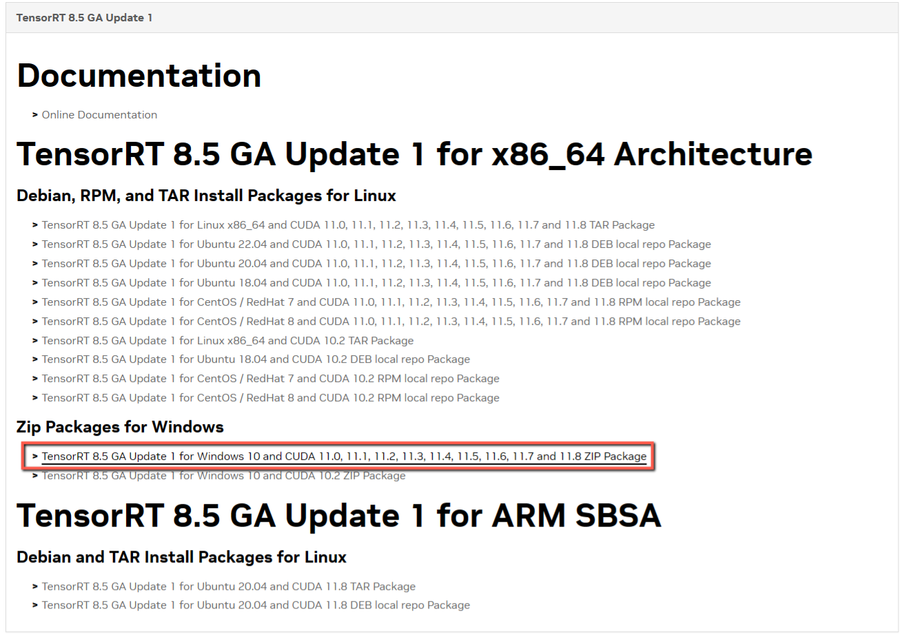
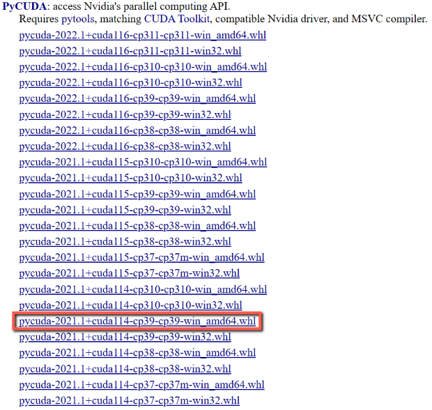
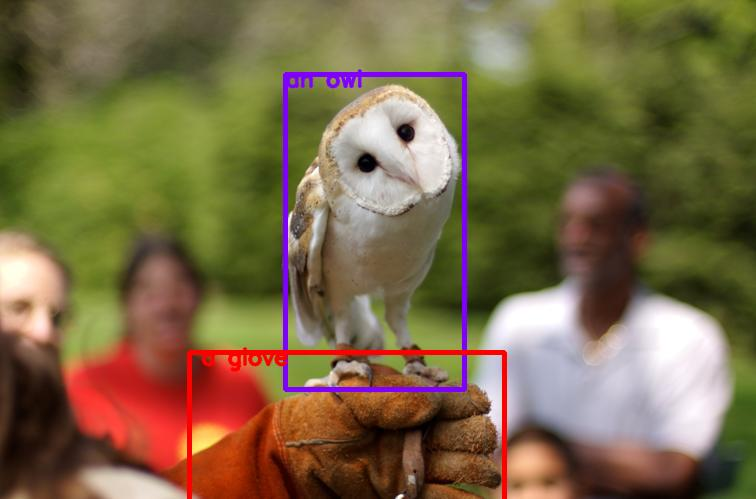

<h1 align="center">NanoOWL</h1>

<p align="center"><a href="#usage"/>👍 Usage</a> - <a href="#performance"/>⏱️ Performance</a> - <a href="#setup">🛠️ Setup</a> - <a href="#examples">🤸 Examples</a> <br> - <a href="#acknowledgement">👏 Acknowledgment</a> - <a href="#see-also">🔗 See also</a></p>

NanoOWL is a project that optimizes [OWL-ViT](https://huggingface.co/docs/transformers/model_doc/owlvit) to run 🔥 ***real-time*** 🔥 on [NVIDIA Jetson Orin Platforms](https://store.nvidia.com/en-us/jetson/store) with [NVIDIA TensorRT](https://developer.nvidia.com/tensorrt).  NanoOWL also introduces a new "tree detection" pipeline that combines OWL-ViT and CLIP to enable nested detection and classification of anything, at any level, simply by providing text.

<p align="center">
</p>

> Interested in detecting object masks as well?  Try combining NanoOWL with
> [NanoSAM](https://github.com/NVIDIA-AI-IOT/nanosam) for zero-shot open-vocabulary 
> instance segmentation.

<a id="setup"></a>
## 🛠️ Setup

1. Install [Anaconda](https://www.anaconda.com/download)
2. Create Enviroment
    
    ```powershell
    conda create -n NanoOWL python=3.11
    conda activate NanoOWL
    conda update pip
    ```
    
3. Install [PyTorch](https://pytorch.org/get-started/previous-versions/)
    
    ```powershell
    # https://docs.nvidia.com/jetson/jetpack/release-notes/index.html#jetpack-version
    # CUDA 11.8
    # cuDNN 8.9.2.26
    # TensorRT 8.5.2 
    # OpenCV 4.5.4
    conda install pytorch==2.0.1 torchvision==0.15.2 torchaudio==2.0.2 pytorch-cuda=11.8 -c pytorch -c nvidia
    conda install cudatoolkit=11.8 cudnn=8.9.2.26 -c conda-forge
    ```
    
4. Install the NanoOWL package.
    
    ```powershell
    git clone https://github.com/NVIDIA-AI-IOT/nanoowl
    cd nanoowl
    python setup.py develop --user
    mkdir data
    ```
    
5. Install [TensorRT](https://developer.nvidia.com/nvidia-tensorrt-8x-download)
    
    
    
    ```powershell
    cp "C:/Users/<user>/Downloads/TensorRT-8.5.2.2.Windows10.x86_64.cuda-11.8.cudnn8.6.zip" "./"
    Expand-Archive "./TensorRT-8.5.2.2.Windows10.x86_64.cuda-11.8.cudnn8.6.zip" "./"
    rm "./TensorRT-8.5.2.2.Windows10.x86_64.cuda-11.8.cudnn8.6.zip"
    mv "./TensorRT-8.5.2.2" "./TensorRT"
    pip install "./TensorRT/python/tensorrt-8.5.2.2-cp39-none-win_amd64.whl"
    ```
    
6. Install [pucuda](https://www.lfd.uci.edu/~gohlke/pythonlibs/?cm_mc_uid=08085305845514542921829&cm_mc_sid_50200000=1456395916&cm_mc_uid=08085305845514542921829&cm_mc_sid_50200000=1456395916#pycuda)
    
    

    ```powershell
    pip install "C:/Users/<user>/Downloads/pycuda-2021.1+cuda114-cp39-cp39-win_amd64.whl"
    ```
    
7. Install [cuda-python](https://nvidia.github.io/cuda-python/install.html)
    
    ```powershell
    conda install -c nvidia -c conda-forge cuda-python=11.8
    conda install -c conda-forge cuda-python=11.8
    ```
    
8. Install [torch2trt](https://github.com/NVIDIA-AI-IOT/torch2trt)
    
    ```powershell
    pip install packaging
    # set $env:CUDA_HOME="<your_cuda_install_path>"
    $env:CUDA_HOME="C:\Users\<user>\anaconda3\envs\NanoOWL\Lib\site-packages\torch\cuda" 
    pip install git+https://github.com/NVIDIA-AI-IOT/torch2trt.git
    ```
    
9. Install the python library
    
    ```powershell
    pip install transformers timm accelerate opencv-python onnx onnxscript matplotlib
    pip install git+https://github.com/openai/CLIP.git
    ```
    
10. Build the TensorRT engine for the OWL-ViT vision encoder
    
    ```bash
    cp "C:/Users/<user>/anaconda3/envs/NanoOWL/bin/cudart64_110.dll" "./TensorRT/bin"
    cp "C:/Users/<user>/anaconda3/envs/NanoOWL/bin/cublas64_11.dll" "./TensorRT/bin"
    cp "C:/Users/<user>/anaconda3/envs/NanoOWL/bin/cublasLt64_11.dll" "./TensorRT/bin"
    cp "C:/Users/<user>/anaconda3/envs/NanoOWL/Lib/site-packages/torch/lib/cudnn64_8.dll" "./TensorRT/bin"
    python -m nanoowl.build_image_encoder_engine data/owl_image_encoder_patch32.engine
    ```
    
11. Run an example prediction to ensure everything is working
    
    ```bash
    cd examples
    python owl_predict.py --prompt="[an owl, a glove]" --threshold=0.1 --image_encoder_engine=../data/owl_image_encoder_patch32.engine
    ```
    

That’s it! If everything is working properly, you should see a visualization saved to ``data/owl_predict_out.jpg``.
<p align="center">


<a id="examples"></a>
## 🤸 Example

### Tree prediction (Live Camera)


This example demonstrates the tree predictor running on a live camera feed with live-edited text prompts. To run the example

1. Ensure you have a camera device connected
2. Launch the demo
    
    ```powershell
    cd examples/tree_demo 
    python tree_demo.py ../../data/owl_image_encoder_patch32.engine
    ```
    
3. Second, open your browser to ``http://<ip address>:7860``
4. Type whatever prompt you like to see what works! Here are some examples
    - Example: [a face [a nose, an eye, a mouth]]
    - Example: [a face (interested, yawning / bored)]
    - Example: (indoors, outdoors)


<a id="acknowledgement"></a>
## 👏 Acknowledgement

Thanks to the authors of [OWL-ViT](https://huggingface.co/docs/transformers/model_doc/owlvit) for the great open-vocabluary detection work.

<a id="see-also"></a>
## 🔗 See also

- [NanoSAM](https://github.com/NVIDIA-AI-IOT/nanosam) - A real-time Segment Anything (SAM) model variant for NVIDIA Jetson Orin platforms.
- [Jetson Introduction to Knowledge Distillation Tutorial](https://github.com/NVIDIA-AI-IOT/jetson-intro-to-distillation) - For an introduction to knowledge distillation as a model optimization technique.
- [Jetson Generative AI Playground](https://nvidia-ai-iot.github.io/jetson-generative-ai-playground/) - For instructions and tips for using a variety of LLMs and transformers on Jetson.
- [Jetson Containers](https://github.com/dusty-nv/jetson-containers) - For a variety of easily deployable and modular Jetson Containers
